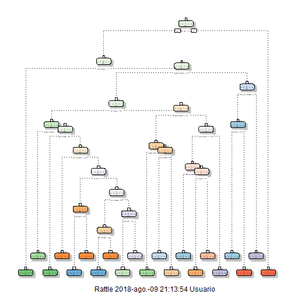
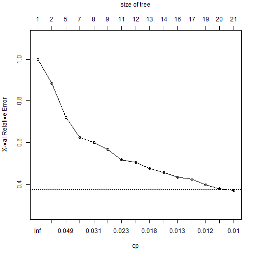

# Overview

This document presents three different machine-learning models that predicts if the movement collected by different type of sensors is correct or incorrect.
It is based on the data obtained by a experiment created by *Wallace Ugulino, Débora Cardador, Katia Vega, Eduardo Velloso, Ruy Milidiú and Hugo Fuks from Pontifical Catholic University of Rio de Janeiro, Informatics Department and School of Computing and Communications, Lancaster University, UK*.
The experiments collected information from accelerometers on the belt, forearm, arm, and dumbell of 6 participants. They were asked to perform barbell lifts correctly and incorrectly in 5 different ways. Every way was classified by a letter **A**, **B**, **C**, **D** & **E**.

# Obtaining & preparing the data
First,  the required libraries for the execution of the R code are loaded.

```r
library(caret);library(dplyr);library(rpart);library(rattle);library(randomForest);library(gbm)
```

Then, both csv's are obtained and all possible NA's values are processed.

```r
if (!file.exists("./data/training.csv")) {
      download.file(
      "https://d396qusza40orc.cloudfront.net/predmachlearn/pml-training.csv",
      "./data/training.csv"
      )
      
}
train <-
read.csv("./data/training.csv",
na.strings = c("NA", "#DIV/0!", ""))

if (!file.exists("./data/testing.csv")) {
download.file(
"https://d396qusza40orc.cloudfront.net/predmachlearn/pml-testing.csv",
"./data/testing.csv"
)


}
test <-
read.csv("./data/testing.csv",
na.strings = c("NA", "#DIV/0!", "")
)
dim(train);dim(test)
```

```
## [1] 19622   160
```

```
## [1]  20 160
```
Then, train data set is separated on training and validation data set in order to avoid over-fitting problems. The percentile chosen is **60 %** as the dataset is pretty big; 19.000 rows with 160 columns.


```r
set.seed(9125)
inTrain <- createDataPartition(y = train$classe, p = .6, list = F)
training <- train[inTrain,]
validation <- train[-inTrain,]
dim(training)
```

```
## [1] 11776   160
```

```r
dim(validation)
```

```
## [1] 7846  160
```

```r
str(training)
```

```
## 'data.frame':	11776 obs. of  160 variables:
##  $ X                       : int  4 5 10 11 14 15 16 18 19 20 ...
##  $ user_name               : Factor w/ 6 levels "adelmo","carlitos",..: 2 2 2 2 2 2 2 2 2 2 ...
##  $ raw_timestamp_part_1    : int  1323084232 1323084232 1323084232 1323084232 1323084232 1323084232 1323084232 1323084232 1323084232 1323084232 ...
##  $ raw_timestamp_part_2    : int  120339 196328 484434 500302 576390 604281 644302 732306 740353 788335 ...
##  $ cvtd_timestamp          : Factor w/ 20 levels "02/12/2011 13:32",..: 9 9 9 9 9 9 9 9 9 9 ...
##  $ new_window              : Factor w/ 2 levels "no","yes": 1 1 1 1 1 1 1 1 1 1 ...
##  $ num_window              : int  12 12 12 12 12 12 12 12 12 12 ...
##  $ roll_belt               : num  1.48 1.48 1.45 1.45 1.42 1.45 1.48 1.55 1.57 1.59 ...
##  $ pitch_belt              : num  8.05 8.07 8.17 8.18 8.21 8.2 8.15 8.08 8.06 8.07 ...
##  $ yaw_belt                : num  -94.4 -94.4 -94.4 -94.4 -94.4 -94.4 -94.4 -94.4 -94.4 -94.4 ...
##  $ total_accel_belt        : int  3 3 3 3 3 3 3 3 3 3 ...
##  $ kurtosis_roll_belt      : num  NA NA NA NA NA NA NA NA NA NA ...
##  $ kurtosis_picth_belt     : num  NA NA NA NA NA NA NA NA NA NA ...
##  $ kurtosis_yaw_belt       : logi  NA NA NA NA NA NA ...
##  $ skewness_roll_belt      : num  NA NA NA NA NA NA NA NA NA NA ...
##  $ skewness_roll_belt.1    : num  NA NA NA NA NA NA NA NA NA NA ...
##  $ skewness_yaw_belt       : logi  NA NA NA NA NA NA ...
##  $ max_roll_belt           : num  NA NA NA NA NA NA NA NA NA NA ...
##  $ max_picth_belt          : int  NA NA NA NA NA NA NA NA NA NA ...
##  $ max_yaw_belt            : num  NA NA NA NA NA NA NA NA NA NA ...
##  $ min_roll_belt           : num  NA NA NA NA NA NA NA NA NA NA ...
##  $ min_pitch_belt          : int  NA NA NA NA NA NA NA NA NA NA ...
##  $ min_yaw_belt            : num  NA NA NA NA NA NA NA NA NA NA ...
##  $ amplitude_roll_belt     : num  NA NA NA NA NA NA NA NA NA NA ...
##  $ amplitude_pitch_belt    : int  NA NA NA NA NA NA NA NA NA NA ...
##  $ amplitude_yaw_belt      : num  NA NA NA NA NA NA NA NA NA NA ...
##  $ var_total_accel_belt    : num  NA NA NA NA NA NA NA NA NA NA ...
##  $ avg_roll_belt           : num  NA NA NA NA NA NA NA NA NA NA ...
##  $ stddev_roll_belt        : num  NA NA NA NA NA NA NA NA NA NA ...
##  $ var_roll_belt           : num  NA NA NA NA NA NA NA NA NA NA ...
##  $ avg_pitch_belt          : num  NA NA NA NA NA NA NA NA NA NA ...
##  $ stddev_pitch_belt       : num  NA NA NA NA NA NA NA NA NA NA ...
##  $ var_pitch_belt          : num  NA NA NA NA NA NA NA NA NA NA ...
##  $ avg_yaw_belt            : num  NA NA NA NA NA NA NA NA NA NA ...
##  $ stddev_yaw_belt         : num  NA NA NA NA NA NA NA NA NA NA ...
##  $ var_yaw_belt            : num  NA NA NA NA NA NA NA NA NA NA ...
##  $ gyros_belt_x            : num  0.02 0.02 0.03 0.03 0.02 0 0 0 0 0.02 ...
##  $ gyros_belt_y            : num  0 0.02 0 0 0 0 0 0.02 0 0 ...
##  $ gyros_belt_z            : num  -0.03 -0.02 0 -0.02 -0.02 0 0 0 -0.02 -0.02 ...
##  $ accel_belt_x            : int  -22 -21 -21 -21 -22 -21 -21 -21 -20 -22 ...
##  $ accel_belt_y            : int  3 2 4 2 4 2 4 5 5 5 ...
##  $ accel_belt_z            : int  21 24 22 23 21 22 23 21 21 22 ...
##  $ magnet_belt_x           : int  -6 -6 -3 -5 -8 -1 0 1 -3 -1 ...
##  $ magnet_belt_y           : int  604 600 609 596 598 597 592 600 603 604 ...
##  $ magnet_belt_z           : int  -310 -302 -308 -317 -310 -310 -305 -316 -313 -314 ...
##  $ roll_arm                : num  -128 -128 -128 -128 -128 -129 -129 -129 -129 -129 ...
##  $ pitch_arm               : num  22.1 22.1 21.6 21.5 21.4 21.4 21.3 21.2 21.2 21.1 ...
##  $ yaw_arm                 : num  -161 -161 -161 -161 -161 -161 -161 -161 -161 -161 ...
##  $ total_accel_arm         : int  34 34 34 34 34 34 34 34 34 34 ...
##  $ var_accel_arm           : num  NA NA NA NA NA NA NA NA NA NA ...
##  $ avg_roll_arm            : num  NA NA NA NA NA NA NA NA NA NA ...
##  $ stddev_roll_arm         : num  NA NA NA NA NA NA NA NA NA NA ...
##  $ var_roll_arm            : num  NA NA NA NA NA NA NA NA NA NA ...
##  $ avg_pitch_arm           : num  NA NA NA NA NA NA NA NA NA NA ...
##  $ stddev_pitch_arm        : num  NA NA NA NA NA NA NA NA NA NA ...
##  $ var_pitch_arm           : num  NA NA NA NA NA NA NA NA NA NA ...
##  $ avg_yaw_arm             : num  NA NA NA NA NA NA NA NA NA NA ...
##  $ stddev_yaw_arm          : num  NA NA NA NA NA NA NA NA NA NA ...
##  $ var_yaw_arm             : num  NA NA NA NA NA NA NA NA NA NA ...
##  $ gyros_arm_x             : num  0.02 0 0.02 0.02 0.02 0.02 0.02 0.02 0.02 0.02 ...
##  $ gyros_arm_y             : num  -0.03 -0.03 -0.03 -0.03 0 0 0 -0.02 -0.02 -0.02 ...
##  $ gyros_arm_z             : num  0.02 0 -0.02 0 -0.03 -0.03 -0.03 -0.03 -0.02 -0.02 ...
##  $ accel_arm_x             : int  -289 -289 -288 -290 -288 -289 -289 -288 -289 -289 ...
##  $ accel_arm_y             : int  111 111 110 110 111 111 109 108 109 109 ...
##  $ accel_arm_z             : int  -123 -123 -124 -123 -124 -124 -121 -124 -122 -125 ...
##  $ magnet_arm_x            : int  -372 -374 -376 -366 -371 -374 -367 -373 -369 -373 ...
##  $ magnet_arm_y            : int  344 337 334 339 331 342 340 336 340 335 ...
##  $ magnet_arm_z            : int  512 506 516 509 523 510 509 510 509 514 ...
##  $ kurtosis_roll_arm       : num  NA NA NA NA NA NA NA NA NA NA ...
##  $ kurtosis_picth_arm      : num  NA NA NA NA NA NA NA NA NA NA ...
##  $ kurtosis_yaw_arm        : num  NA NA NA NA NA NA NA NA NA NA ...
##  $ skewness_roll_arm       : num  NA NA NA NA NA NA NA NA NA NA ...
##  $ skewness_pitch_arm      : num  NA NA NA NA NA NA NA NA NA NA ...
##  $ skewness_yaw_arm        : num  NA NA NA NA NA NA NA NA NA NA ...
##  $ max_roll_arm            : num  NA NA NA NA NA NA NA NA NA NA ...
##  $ max_picth_arm           : num  NA NA NA NA NA NA NA NA NA NA ...
##  $ max_yaw_arm             : int  NA NA NA NA NA NA NA NA NA NA ...
##  $ min_roll_arm            : num  NA NA NA NA NA NA NA NA NA NA ...
##  $ min_pitch_arm           : num  NA NA NA NA NA NA NA NA NA NA ...
##  $ min_yaw_arm             : int  NA NA NA NA NA NA NA NA NA NA ...
##  $ amplitude_roll_arm      : num  NA NA NA NA NA NA NA NA NA NA ...
##  $ amplitude_pitch_arm     : num  NA NA NA NA NA NA NA NA NA NA ...
##  $ amplitude_yaw_arm       : int  NA NA NA NA NA NA NA NA NA NA ...
##  $ roll_dumbbell           : num  13.4 13.4 13.3 13.1 13.4 ...
##  $ pitch_dumbbell          : num  -70.4 -70.4 -70.9 -70.6 -71 ...
##  $ yaw_dumbbell            : num  -84.9 -84.9 -84.4 -84.7 -84.3 ...
##  $ kurtosis_roll_dumbbell  : num  NA NA NA NA NA NA NA NA NA NA ...
##  $ kurtosis_picth_dumbbell : num  NA NA NA NA NA NA NA NA NA NA ...
##  $ kurtosis_yaw_dumbbell   : logi  NA NA NA NA NA NA ...
##  $ skewness_roll_dumbbell  : num  NA NA NA NA NA NA NA NA NA NA ...
##  $ skewness_pitch_dumbbell : num  NA NA NA NA NA NA NA NA NA NA ...
##  $ skewness_yaw_dumbbell   : logi  NA NA NA NA NA NA ...
##  $ max_roll_dumbbell       : num  NA NA NA NA NA NA NA NA NA NA ...
##  $ max_picth_dumbbell      : num  NA NA NA NA NA NA NA NA NA NA ...
##  $ max_yaw_dumbbell        : num  NA NA NA NA NA NA NA NA NA NA ...
##  $ min_roll_dumbbell       : num  NA NA NA NA NA NA NA NA NA NA ...
##  $ min_pitch_dumbbell      : num  NA NA NA NA NA NA NA NA NA NA ...
##  $ min_yaw_dumbbell        : num  NA NA NA NA NA NA NA NA NA NA ...
##  $ amplitude_roll_dumbbell : num  NA NA NA NA NA NA NA NA NA NA ...
##   [list output truncated]
```
As we see the result of the STR command, the dataset contains several columns with hardly any impact on the outcome: low covariation or too many NA's.
First we are going to remove the zero covariates with cared function **nearZeroVar**. It will be applied so on training set as the validation set.
Besides, the 5 first columns with information about the executor and the time when the exercise is done has been removed as the experiment's design discarded this as relevant.


```r
nsv <- nearZeroVar(training)
training <- training[, -c(nsv,c(1:5))]
validation <- validation[, -c(nsv,c(1:5))]
dim(training)
```

```
## [1] 11776   124
```

```r
dim(validation)
```

```
## [1] 7846  124
```
36 columns have been removed for non covariation.
Now, the columns with more than 75 % of NAs will be removed as well as they hardly interacts with the outcome with all that missing information.

```r
rNas <- colMeans(is.na(training))
training<- training [,rNas < .75 ]
validation <- validation[,rNas < .75]
dim(training)
```

```
## [1] 11776    54
```

```r
dim(validation)
```

```
## [1] 7846   54
```
Finally, the training and validation data sets will be processed with 1 outcome **classe** and 53 predictors. 
# Prediction Models
The outcome is a category or a factor so we are facing a classification problem.
The best prediction algorithms to this case should be **Decision Trees** and **Random Forest**. Additionally as its behavior is pretty good and ensembles very easy with other models: Gradient Boosting Machine(GBM) will be applied.
## Decision Tree
First, the Decision Tree model is created with **rpart** function and the tree nodes and branches are shown:


```r
treeModel <- rpart(classe ~ ., data=training, method="class")
fancyRpartPlot(treeModel)
```

```
## Warning: labs do not fit even at cex 0.15, there may be some overplotting
```


Now, the X-Validation info is shown and the prediction model is appled to the validation set and the confusion Matrix is obtained:

```r
plotcp(treeModel)
```



```r
predTree <- predict(treeModel, newdata = validation, type="class")
confusionMatrix(predTree, validation$classe)
```

```
## Confusion Matrix and Statistics
## 
##           Reference
## Prediction    A    B    C    D    E
##          A 2012  330   68  149   97
##          B   72  832   55   45  127
##          C   27  107 1135  190  122
##          D  103  183   79  835  150
##          E   18   66   31   67  946
## 
## Overall Statistics
##                                           
##                Accuracy : 0.7341          
##                  95% CI : (0.7242, 0.7439)
##     No Information Rate : 0.2845          
##     P-Value [Acc > NIR] : < 2.2e-16       
##                                           
##                   Kappa : 0.6618          
##  Mcnemar's Test P-Value : < 2.2e-16       
## 
## Statistics by Class:
## 
##                      Class: A Class: B Class: C Class: D Class: E
## Sensitivity            0.9014   0.5481   0.8297   0.6493   0.6560
## Specificity            0.8853   0.9527   0.9312   0.9215   0.9716
## Pos Pred Value         0.7575   0.7356   0.7179   0.6185   0.8387
## Neg Pred Value         0.9576   0.8978   0.9628   0.9306   0.9262
## Prevalence             0.2845   0.1935   0.1744   0.1639   0.1838
## Detection Rate         0.2564   0.1060   0.1447   0.1064   0.1206
## Detection Prevalence   0.3385   0.1441   0.2015   0.1721   0.1438
## Balanced Accuracy      0.8934   0.7504   0.8804   0.7854   0.8138
```
It has a 73 % accuracy that is not really so good. We will test with the other algorithms.
## Random Forest
The next, and possible the most popular, model for classification problems is Random Forest that bassicaly is a combination of Decission Trees and outputs the class that is the mode of the classes. 
**randomForest** functon will be used with a trainControl of *repeatedcv* for an increased cross validation.

```r
trctrl <- trainControl(method = "repeatedcv", number = 10, repeats = 3)
rfModel <- randomForest(classe~.,data=training, trControl=trctrl, proximity=T)
predRF <- predict(rfModel, newdata = validation, type="class")
confusionMatrix(predRF, validation$classe)
```

```
## Confusion Matrix and Statistics
## 
##           Reference
## Prediction    A    B    C    D    E
##          A 2232    2    0    0    0
##          B    0 1516    2    0    0
##          C    0    0 1366   13    0
##          D    0    0    0 1272    2
##          E    0    0    0    1 1440
## 
## Overall Statistics
##                                           
##                Accuracy : 0.9975          
##                  95% CI : (0.9961, 0.9984)
##     No Information Rate : 0.2845          
##     P-Value [Acc > NIR] : < 2.2e-16       
##                                           
##                   Kappa : 0.9968          
##  Mcnemar's Test P-Value : NA              
## 
## Statistics by Class:
## 
##                      Class: A Class: B Class: C Class: D Class: E
## Sensitivity            1.0000   0.9987   0.9985   0.9891   0.9986
## Specificity            0.9996   0.9997   0.9980   0.9997   0.9998
## Pos Pred Value         0.9991   0.9987   0.9906   0.9984   0.9993
## Neg Pred Value         1.0000   0.9997   0.9997   0.9979   0.9997
## Prevalence             0.2845   0.1935   0.1744   0.1639   0.1838
## Detection Rate         0.2845   0.1932   0.1741   0.1621   0.1835
## Detection Prevalence   0.2847   0.1935   0.1758   0.1624   0.1837
## Balanced Accuracy      0.9998   0.9992   0.9983   0.9944   0.9992
```
Surprisingly, the accuracy is incredibly high **99.75 %**, being the 95% confidence interval over the **99 %**. 
This model seems to be the one to choose.

## Gradient Boosting 
After the result obtained with Random Forest, this step should not be necessary. 
Anyway, we are going to generate and apply **GBM** model and check three results.


```r
trctrl2 <-
      trainControl(method = "repeatedcv",
                   number = 10,
                   repeats = 3)
gbmModel <-
      train(
            classe ~ .,
            data = training,
            trControl = trctrl2,
            method = "gbm",
            verbose = F
      )
predGBM <- predict(gbmModel, newdata = validation)
confusionMatrix(predGBM, validation$classe)
```

```
## Confusion Matrix and Statistics
## 
##           Reference
## Prediction    A    B    C    D    E
##          A 2227   13    0    0    0
##          B    5 1490   10    5    5
##          C    0   14 1355   17    3
##          D    0    0    2 1264   11
##          E    0    1    1    0 1423
## 
## Overall Statistics
##                                           
##                Accuracy : 0.9889          
##                  95% CI : (0.9863, 0.9911)
##     No Information Rate : 0.2845          
##     P-Value [Acc > NIR] : < 2.2e-16       
##                                           
##                   Kappa : 0.986           
##  Mcnemar's Test P-Value : NA              
## 
## Statistics by Class:
## 
##                      Class: A Class: B Class: C Class: D Class: E
## Sensitivity            0.9978   0.9816   0.9905   0.9829   0.9868
## Specificity            0.9977   0.9960   0.9948   0.9980   0.9997
## Pos Pred Value         0.9942   0.9835   0.9755   0.9898   0.9986
## Neg Pred Value         0.9991   0.9956   0.9980   0.9967   0.9970
## Prevalence             0.2845   0.1935   0.1744   0.1639   0.1838
## Detection Rate         0.2838   0.1899   0.1727   0.1611   0.1814
## Detection Prevalence   0.2855   0.1931   0.1770   0.1628   0.1816
## Balanced Accuracy      0.9977   0.9888   0.9926   0.9905   0.9933
```
The accuracy is pretty high, **98.89%** but a few cents lower than Random Forest.

## Assembling models
This point should show how to ensemble the 3 proposed models and getting a new one more powerful and accurate.
However, it's not necessary with the accuracy reported by **Random Forest**: **99.75**.
This will be the model to use.  

# Results
Finally, the **Random Forest** is going to be applied to the testing data set but it has be applied the same cleaning and transformations performed on training and validation sets.

```r
test <- test[, -c(nsv,c(1:5))]
test <- test[,rNas < .75]
dim(test)
```

```
## [1] 20 54
```
Finally, the predictions over cleaned test set are the following:

```r
predTest<- predict(rfModel, newdata=test)
predTest
```

```
##  1  2  3  4  5  6  7  8  9 10 11 12 13 14 15 16 17 18 19 20 
##  B  A  B  A  A  E  D  B  A  A  B  C  B  A  E  E  A  B  B  B 
## Levels: A B C D E
```


